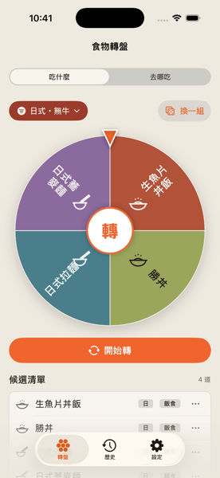
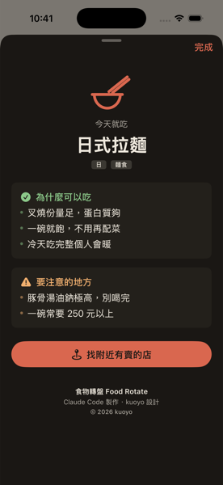
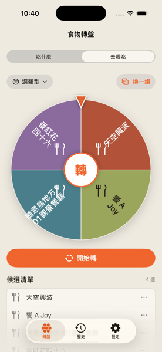
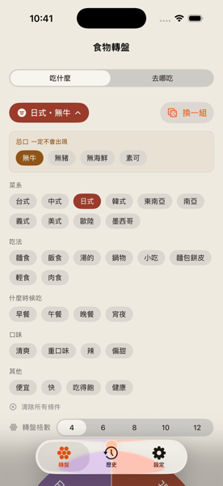
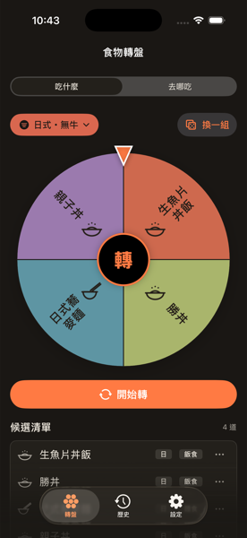
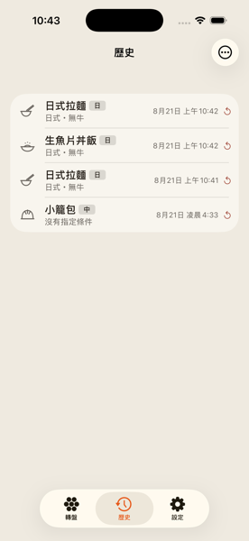

# 食物轉盤 Food Rotate

不知道吃什麼的時候，讓它幫你決定。

iOS App，SwiftUI 寫的。**轉盤本身完全離線** —— 50 道料理內建在 App 裡，不需要網路、不上傳任何資料。
只有「去哪吃」這個模式會用到定位與地圖搜尋（見下）。

| 轉盤 | 結果頁 | 去哪吃 |
|:---:|:---:|:---:|
|  |  |  |

---

## 兩個模式

| | 做什麼 |
|---|---|
| **吃什麼** | 從 50 道內建料理裡抽，可以用 33 個標籤篩條件。完全離線 |
| **去哪吃** | 找附近實際有在營業的餐廳。只有這個模式會用到定位與網路 |

轉完會給一張結果頁：菜名、為什麼可以吃、要注意的地方，還可以直接去找附近有賣的店。

**那 50 道是什麼，兩個地方都看得到：**

| | |
|---|---|
| **App 裡** | 設定 → 菜色資料庫 → **內建料理**。依菜系分組，可以搜尋（菜名與標籤都比對，打「無牛」找得到 32 道），點開看單道的完整標籤與優缺點 |
| **這裡** | [`docs/菜色資料庫.md`](docs/菜色資料庫.md) —— 50 道全文照列，另附標籤覆蓋率表。不裝 App 也看得到，而且 diff 得出來 |

文件那一份是由 `foods.json` 產生的（`Tools/make-food-catalog.swift`），不是手寫的副本，
所以不會有一份說法留在文件裡過期。

---

## 幾個刻意的決定

**忌口永遠不會被自動放寬。** 選了「無牛」，湊不滿轉盤格數時 App 會放寬別的條件，
但不會偷偷把牛肉麵放回來。放寬了哪個維度也一定寫在畫面上。

**「去哪吃」的菜系是搜尋關鍵字，不是篩選條件。** 地圖 API 沒有菜系欄位，
我們做的是拿字比對店名。找不到時會明說「附近沒有 X 的店，改列一般餐廳」，不假裝篩到了。

**每道菜都有缺點。** 候選清單會告訴你其他選項好在哪、雷在哪 —— 目的是讓你有依據推翻它，
不是說服你接受。

| 選條件 | 深色模式 | 歷史 |
|:---:|:---:|:---:|
|  |  |  |

「忌口」在篩選面板裡是獨立的一區，標題就寫著「一定不會出現」—— 那是上面那條規則在畫面上的樣子。
歷史每一筆也記著當時的條件（截圖裡的「日式・無牛」），點右邊的箭頭可以用同一組條件再抽一次。

---

## 技術

|  | 利用的元件 |
|---|---|
| 版本 | 1.1.0（build 2） |
| 平台 | iOS 26.0+ |
| 語言 | Swift 6.0（嚴格併發） |
| UI | SwiftUI，轉盤是 `Canvas` 手繪 + 自訂緩動狀態機 |
| 儲存 | SwiftData（只存轉盤紀錄）、UserDefaults（自訂料理與設定） |
| 地圖 | MapKit |

---

## 專案結構

```
FoodRotate/
  Core/        資料模型與抽樣邏輯，只 import Foundation
  Models/      幾何、排版、設定
  Services/    定位、地圖搜尋、觸覺、資產
  Views/       畫面
  DesignTokens.swift   色票與尺寸的唯一來源（不 import SwiftUI）
  Theme.swift          把 token 包成 SwiftUI 型別

FoodRotateTests/       116 個單元測試（23 個 suite）
FoodRotateWidget/      桌面小工具
Tools/make-icon.swift          App Icon 產生器，讀同一份 DesignTokens
Tools/make-food-catalog.swift  菜色資料庫產生器，跟 App 編同一批 Core 型別
docs/菜色資料庫.md              上面那支產生的，50 道全文
```

`Core/` 只用 Foundation 是刻意的界線 —— 抽樣邏輯不該知道畫面長什麼樣。

### 文件（這個 repo 裡文件比程式多）

這不是意外。專案是用「PM ／ 設計師 ／ 程式設計師」三個角色分工做出來的，
角色之間靠文件往返：派工單、規格、完工回報、驗收單、問題單。三個資料夾各自有 `README`：

| 資料夾 | 內容 |
|---|---|
| `Design/` | 設計規格、視覺提案、圖示原始檔 |
| `Coder/` | 工程交接、實作回報、驗收與問題單 |
| `PM/` | 跨角色的統整與裁示 |

**這些是當下往返的原始文件，不是事後補寫的。** 所以裡面留著沒通過的驗收
（`PM驗收-S2-未通過.md`、`PM驗收-S4-還差一項.md`）、被退回的做法、以及改變主意的理由。
兩份 QC 稽核報告也照原樣留著，包含它們抓到的實際缺陷。

刻意不整理成一條成功的直線 —— 只留通過的那一版，就看不出哪些判斷當初是有爭議的，
而那正是這批文件唯一有價值的地方。

想看結論不想看過程的話，兩份就夠：[`PROJECT_STATUS.md`](PROJECT_STATUS.md)（現況與已知問題）
和 [`大改紀錄-拿掉語言模型.md`](大改紀錄-拿掉語言模型.md)（最大的一次轉向）。

---

## 建置

```bash
xcodebuild build -scheme FoodRotate -destination 'platform=iOS Simulator,name=iPhone 17 Pro'
xcodebuild test  -scheme FoodRotate -destination 'platform=iOS Simulator,name=iPhone 17 Pro'
```

或直接用 Xcode 開 `FoodRotate.xcodeproj`。

---

## 目前進度

**進度、已知問題與待辦一律看 [`PROJECT_STATUS.md`](PROJECT_STATUS.md)。**

這裡刻意不再寫一份 —— 同一件事寫在兩個地方，過期的一定是沒人記得改的那份。

各階段的規格、驗收與判斷理由留在 `Design/`、`Coder/`、`PM/` 裡。

---

**製作**：Claude Code ／ **設計**：kuoyo

本專案以 MIT 授權釋出，見 [`LICENSE`](LICENSE)。
